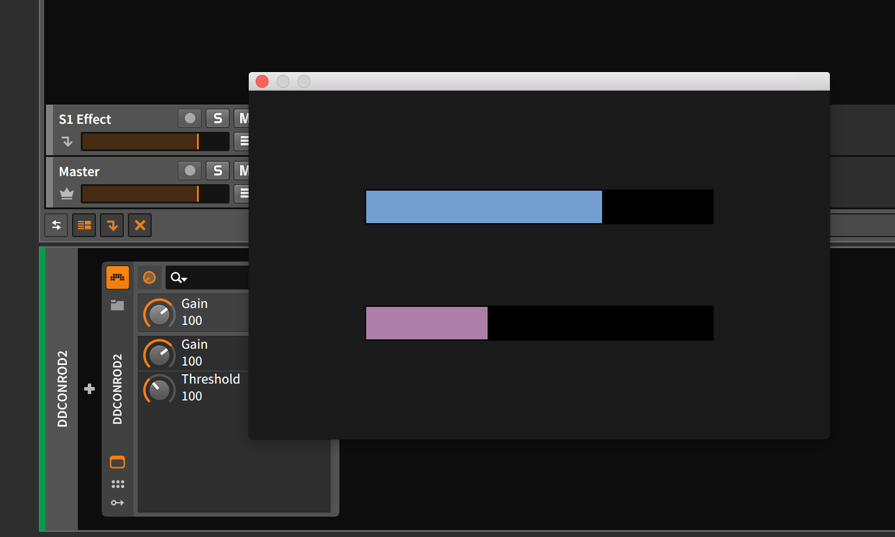

_**NOTE:** This library has been abandoned, it does not even compile with the latest rust due to dependency issues. Updating winit constantly was a painful experience and it does not fit with the style we require for continued development. Instead, I have been working on a new initiative at https://github.com/rust-dsp/rtb-rs - please follow the development there instead._

Simple library for developing VST2 plugins in 100% rust. The Steinberg SDK is not required (thankfully), and I believe therefore your code will not be subject to Steinbergs lame license. Most complexity is abstracted away and the user need only focus on what's important - processing dsp and accessing a simple immediate mode UI via conrod. I'll be looking to move away from conrod as rust matures and better alternatives appear (or I develop my own), as conrod is a truly horrible experience, but for now, using it via dd_core isn't too painful.

Support for audiounit and lv2 will come in the future - any help on this would be highly appreciated!

This library would not exist without overdrivenpotato and boscops hard work on the `rust-vst2` crate.

Currently the code compiles on Mac OS and Windows, with Mac being the first-class citizen over Windows. Increased and ongoing support for Linux and Windows would be nice but I currently only use Mac OS.

You could look at build.sh for an example of how to compile and package a plugin on mac - the vst-bundler script from rust-vst2 is included in the scripts directory.

More examples coming soon!

